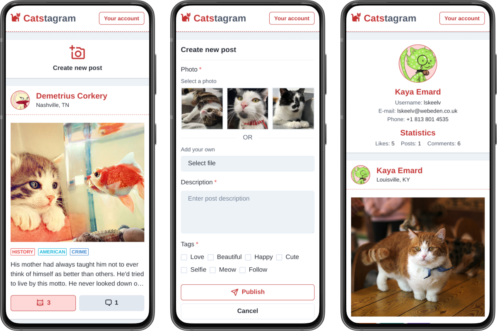

# 🐈 Catstagram

**Catstagram** is a responsive web application inspired by Instagram, but with cats. User and post data come from [**DummyJSON**](https://dummyjson.com), and cat photos come from [**The Cat API**](https://thecatapi.com). Application consists of a home page and user profile pages. Users can interact through likes and comments, as well as publish their own posts.

Application is made in **React** with **Redux Toolkit** and **Chakra UI**. The project template was created by **Create React App**, the code was written in **JavaScript** and **JSX**.

## 🧭️ Explore the application

### [Check out the online demo.](https://mickrzyzak.github.io/catstagram/)

## ⚙️ Features

- Combination of two APIs
- Redux storage
- Responsive web design
- Home page
- Profile pages
- Adding new posts
- Likes and comments
- Simulating likes
- Account change

## 🧱 Technologies

- [React](https://github.com/facebook/react) 18.2.0
- [React Router](https://github.com/remix-run/react-router) 6.21.0
- [React Redux](https://github.com/reduxjs/react-redux) 9.0.4
- [Redux Toolkit](https://github.com/reduxjs/redux-toolkit) 2.0.1
- [Chakra UI](https://github.com/chakra-ui/chakra-ui) 2.8.2

## 🚧️ Requirements

- Node.js and npm
- Browser _(Chrome recommended)_

## 🚀️ Setup

1. `npm install` Install Node dependencies
2. `npm start` Run the application
